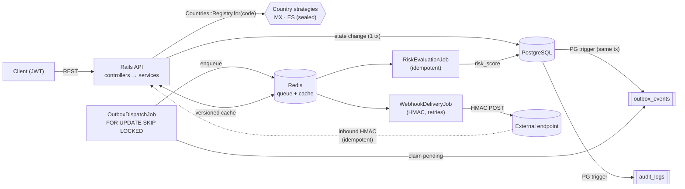

# Bravo Fintech MVP

Multi-country credit-application API for a fintech operating across LATAM and
Europe. Primary implementations: **México (MX)** and **España (ES)**, designed so
that adding a third country is configuration, not code.

> Architectural signature: *"The first implementation defines the architecture; the
> second is configuration, not code."*

**Status:** backend and a React + Tailwind frontend are complete and tested —
authenticated sync CRUD, two countries, the async pipeline (transactional outbox
→ dispatcher → Sidekiq → webhooks), a UI for create / list / detail / status, and
realtime updates over ActionCable. Kubernetes manifests and the scalability
deep-dive are the remaining milestone.

## Stack

Rails 7.2 (API-only) · PostgreSQL 15 · Sidekiq + Redis · JWT · Pundit · AASM ·
React + Tailwind + Vite + Vitest · Docker Compose · RSpec · RuboCop · Kubernetes
(upcoming).

## Architecture



**The core decision (req 3.7 + 3.9):** a PostgreSQL trigger writes an
`outbox_events` row in the *same transaction* as the state change — the state can
never change without an event. A dispatcher claims pending events with
`SELECT … FOR UPDATE SKIP LOCKED`, so N dispatchers run in parallel without ever
double-claiming, and enqueues idempotent Sidekiq jobs. One coherent pattern
covers async work, parallelism, and the produce/consume story.

## Setup (< 5 minutes)

**Prerequisites:** Docker + Docker Compose and `make`. No local Ruby — everything
runs in containers.

```bash
git clone <repo-url> && cd fintech-mvp
make run     # build + boot api, worker, frontend, postgres, redis; then seed sample data
```

`make run` waits until the API is healthy, boots the SPA, and loads seeded users
plus sample MX/ES applications. Open the UI at
**http://localhost:5173** (sign in with a seeded user below). Or use the API
directly — verify and log in:

```bash
curl localhost:3000/up                       # => 200

# Log in (seeded users; password for all: password123)
curl -s localhost:3000/api/v1/login \
  -H 'content-type: application/json' \
  -d '{"email":"operator@bravo.test","password":"password123"}'
# => {"token":"<JWT>","role":"operator"}
```

Seeded users: `admin@bravo.test`, `analyst@bravo.test`, `operator@bravo.test`.

Everything else:

```bash
make run          # boot the full stack and seed sample data
make up           # boot the full stack without seeding
make down         # stop containers
make build        # build the api image
make migrate      # create/migrate the database, including triggers
make seed         # load seeded users and sample applications
make test         # full RSpec suite
make lint         # RuboCop + bundler-audit
make smoke        # end-to-end smoke against the running stack
make deploy       # apply Kubernetes manifests to the current kube-context
make web-test     # frontend component tests (Vitest)
make web-build    # frontend production build
make k8s-validate # validate Kubernetes manifests without a cluster
make console      # Rails console
make logs         # tail all logs; use SERVICES="api worker" to filter
make ps           # show running containers
make help         # list all commands
```

## API tour

The API is namespaced under `/api/v1` and uses JWT bearer authentication except
for login and inbound webhooks.

| Endpoint | Purpose |
|---|---|
| `GET /up` | Health check |
| `POST /api/v1/login` | Authenticate and return a JWT |
| `GET /api/v1/me` | Return the authenticated user |
| `GET /api/v1/countries` | Supported country catalog |
| `POST /api/v1/credit_applications` | Create a credit application |
| `GET /api/v1/credit_applications` | List applications with country/status filters and pagination |
| `GET /api/v1/credit_applications/:id` | Show one application, scope-aware and cached |
| `PATCH /api/v1/credit_applications/:id/status` | Change status with optimistic locking |
| `POST /api/v1/webhooks/bank` | Inbound HMAC-signed bank confirmation webhook |

For hands-on usage, import the Postman files in `docs/`:

- Collection: [`docs/Bravo Fintech MVP.postman_collection.json`](docs/Bravo%20Fintech%20MVP.postman_collection.json)
- Local environment: [`docs/Bravo Fintech MVP Local.postman_environment.json`](docs/Bravo%20Fintech%20MVP%20Local.postman_environment.json)

Run `make run`, select the local Postman environment, then run `Auth → POST
/login` first. The collection stores the JWT, created application IDs,
`lock_version`, and signs inbound webhook requests automatically.

Valid sample documents: MX CURP `HEGG560427MVZRRL04`, ES DNI `12345678Z`, ES
NIE `X1234567L`.

## Assumptions

- **Bank providers are simulated.** Each country's `BankProvider` returns a
  provider-specific shape derived deterministically from the document number
  (stable across fetches and tests). A per-country `Normalizer` maps it to one
  internal `BankData` (`total_debt` / `credit_score` / `account_status`); the raw
  payload is retained in `jsonb` for audit.
- **Encryption / blind-index / JWT / webhook keys** are read from the
  environment. The development defaults in `config/application.rb` and
  `.env.example` are **non-secret placeholders** — production supplies real keys
  via the secrets manager.
- **Business rules:** MX — `amount_requested ≤ monthly_income × 30`; ES —
  `amount_requested ≤ €50,000`. A breach routes the application to `under_review`
  with a `requires_review` flag.
- **The external webhook endpoint is simulated** (`WEBHOOK_ENDPOINT_URL`,
  default `example.com`); failed deliveries are recorded and retried by Sidekiq.
- **Deliberately out of scope for now** (see `EXECUTION_PLAN.md → Backlog`): rate
  limiting, circuit breakers, dead-letter queues, Prometheus metrics, tracing.

## Data model

UUID primary keys throughout (multi-country fintech: avoids collisions and does
not leak volume through sequential IDs).

```
users                       credit_applications              bank_records
─────                       ───────────────────              ────────────
id (uuid, pk)               id (uuid, pk)            1     1  id (uuid, pk)
email (citext, uniq)        country                ───────  credit_application_id (fk)
password_digest             full_name      (enc)             provider
role (enum)                 document_number(enc, det)        total_debt   ┐ normalized
                            document_fingerprint (uniq)      credit_score │ from the raw
                            monthly_income (enc)             account_status┘ provider shape
                            amount_requested                 raw_payload (jsonb)
                            status / risk_score / flags      fetched_at
                            lock_version (optimistic)
                               │ 1        │ 1
                    ┌──────────┘          └──────────┐
                    │ N                              │ N
            state_transitions                 webhook_deliveries
            from/to_state, actor_id,          endpoint, status, attempts, last_response

Async / audit (driven by PG triggers):  outbox_events · audit_logs · webhook_events
```

Key decisions:

- **PII at rest** (`full_name`, `document_number`, `monthly_income`) is encrypted
  with Active Record encryption. `document_number` uses **deterministic**
  encryption so it stays searchable for dedupe; the others use stronger
  **non-deterministic** encryption. `amount_requested` is not PII → plaintext.
- **`document_fingerprint`** is a keyed HMAC of the normalized document number,
  uniquely indexed — dedupe/lookup without ever decrypting.
- **`raw_payload` (`jsonb`)** keeps the provider response verbatim, decoupling the
  domain from provider shape changes (only the Normalizer moves).
- **Indexes:** `(country, status, created_at)` for the critical listing query;
  unique `(document_fingerprint)`; partial `(created_at) WHERE processed_at IS NULL`
  on the outbox; FK indexes.

## Technical decisions (with tradeoffs)

- **Transactional outbox over publish-to-queue-directly.** Guarantees atomicity
  of state↔event (a PG trigger writes the event in the same transaction). Cost:
  polling latency from the dispatcher — mitigable with PostgreSQL LISTEN/NOTIFY
  or a tighter loop. Chosen over event sourcing/CQRS, which would be
  over-engineering here.
- **`SELECT … FOR UPDATE SKIP LOCKED` for the dispatcher.** Lets K dispatchers run
  as independent replicas with no coordination; each skips rows another holds.
  Delivery is at-least-once, so consumers are idempotent.
- **Country logic sealed behind a registry.** All country behavior lives in
  `app/countries/<code>/` and resolves via `Countries::Registry`; country codes
  never appear in controllers/services/jobs/models. Adding a country is purely
  additive (see below). The state machine (AASM) lives in a PORO that wraps the
  application, so the shared model carries no country/state logic.
- **SQL schema format + PostgreSQL 15.** Triggers/functions can't be represented
  in Ruby `schema.rb`, so `db/structure.sql` is the source of truth (and the test
  DB has the triggers). PG pinned to 15 to match the `pg_dump` client in the image.
- **Result pattern** (`Success`/`Failure`) instead of exceptions for control flow;
  jobs receive IDs and are idempotent.

## Security

- **PII encrypted at rest**; serializers are **scope-aware** — operators get a
  redacted view, analysts/admins see PII (`CreditApplicationPolicy#view_pii?`).
- **JWT** bearer auth on every endpoint by default (opt-out for login + webhooks).
- **Pundit** role authorization (operator / analyst / admin).
- **No PII in logs** — `StructuredLogger` emits JSON with `event`/`country`/
  `application_id` and strips PII keys defensively.
- **No plaintext PII in the audit trail** — the audit trigger captures the
  ciphertext for encrypted columns.
- **HMAC-SHA256** on webhooks (inbound verified over the raw body; outbound signed).
- Secrets are env-injected; `config/master.key` and `.env` are git-ignored.

## Scalability (millions of applications)

The design targets a table that grows without bound while the hot working set
(recent, non-terminal applications) stays small.

### Indexes

- **`(country, status, created_at)`** — the critical listing query
  (`country` + `status`, newest first) is served straight from this composite
  index; the trailing `created_at` also covers the ORDER BY.
- **unique `(document_fingerprint)`** — O(log n) dedupe/lookup by document
  without decrypting; the blind index keeps it search-friendly while the
  document itself stays encrypted.
- **partial `(created_at) WHERE processed_at IS NULL`** on `outbox_events` — the
  dispatcher only ever scans *pending* rows, so the index stays tiny even as the
  outbox accumulates millions of processed rows.
- **BRIN on `created_at`** for very large append-only tables (audit/outbox/
  state_transitions) — date-range scans at a fraction of a btree's size.

### Partitioning

Declarative partitioning, two levels:

- **`LIST (country)`** — each country is isolated in its own partition. Queries
  filtered by country (the common case) hit only that partition (partition
  pruning); a noisy country can't bloat another's indexes; per-country retention
  and even per-country tablespaces become possible. This pairs naturally with the
  sealed country strategies. Chosen over `HASH` because access is overwhelmingly
  country-scoped and the cardinality is tiny and known.
- **sub-partition `RANGE (created_at)` (monthly)** — within a country, time
  ranges split the hot recent months from cold history. `pg_partman` manages the
  rolling window (create next month, detach/drop old).

### Critical queries

| Query | Plan |
|---|---|
| List by country + status + date | composite index + **partition pruning** (only the country's recent partitions) |
| Fetch one by id | PK lookup, then served from the **versioned cache** |
| Dedupe by document | unique `document_fingerprint` index |
| Outbox drain | partial index + `FOR UPDATE SKIP LOCKED LIMIT N` |

N+1 is structurally prevented (eager-loaded associations, `exists?` over
`present?`, `find_each` for batches) and **enforced in tests by Bullet**.

### Bottlenecks & mitigations

- **Hot status rows** — `SKIP LOCKED` (dispatcher) + optimistic locking (`409`)
  keep concurrent writers correct without long locks.
- **Queue saturation** — separate Sidekiq queues by priority (risk vs webhook vs
  audit) with independent worker replicas, so a slow webhook endpoint can't
  starve risk scoring.
- **Outbox growth** — a periodic job prunes `processed_at IS NOT NULL` rows past
  a short horizon; the partial index means drain performance never degrades.
- **Read load** — single-record reads are cache-absorbed; heavy listing/reporting
  goes to **read replicas**. With many app replicas, **PgBouncer** caps DB
  connections.

### Archival

Applications in a terminal state (`approved`/`rejected`/`cancelled`) older than N
months are cold. Because of `RANGE(created_at)` partitioning, retiring them is a
partition **detach + drop (O(1))** or an export to **S3 + Parquet** for
analytics — no giant `DELETE`. Audit/outbox history follows the same rolling
archival.

## Concurrency

- **Transactional outbox + `SKIP LOCKED`**: N dispatcher replicas, no double
  processing. Scaling = more replicas (`docker compose up --scale worker=N`), no
  code change.
- **Idempotent jobs**: `RiskEvaluationJob` writes `risk_score` via a conditional
  `UPDATE … WHERE risk_score IS NULL`; webhook inbound dedupes by `idempotency_key`.
- **Optimistic locking** (`lock_version`) on status changes → `409` on a stale write.
- **AASM guards** reject invalid transitions (`422`, state unchanged).

## Caching

- **Single-application reads** cached via `Applications::CachedView`, keyed by
  `cache_key_with_version` (id + `updated_at`) **and PII scope**. A write changes
  `updated_at` → the key changes → stale data is never served (no manual busting),
  and an operator's redacted view is never served to an analyst.
- **Country catalog** (`Countries::Catalog`) cached with a 12h TTL (it only
  changes on deploy). Store: `redis_cache_store` (dev/prod), `memory_store` (test).

## Webhooks

- **Outbound** (`WebhookDeliveryJob`, triggered on status change via the outbox):
  HMAC-signed POST to the external endpoint, each attempt recorded in
  `webhook_deliveries`, raises on failure so Sidekiq retries.
- **Inbound** (`POST /api/v1/webhooks/bank`): signature verified over the raw
  body; deduped by `idempotency_key` (unique index + pre-check) so a replay is
  processed exactly once; mutates the application (bank confirmation).

## How to add a country (architectural signature)

Adding a country is *configuration, not shared business-code change*:

1. Create `app/countries/<code>/` with the four strategy classes (`Validator`,
   `BankProvider`, `Normalizer`, `StateMachine`).
2. Add one line to `Countries::Registry::NAMESPACES`.
3. Add the Zeitwerk acronym mapping in `config/application.rb`, e.g.
   `"co" => "CO"`, so `app/countries/co/` resolves to `Countries::CO` instead
   of `Countries::Co`.

Nothing in controllers, services, jobs, serializers, or models changes.

**Evidence — adding España (ES):**

- **Shared business-code files changed outside `app/countries/es/`: 1** —
  `app/countries/registry.rb` (the registry line). The Rails autoload acronym
  mapping lives in `config/application.rb`; no controller/service/job/serializer/
  model was touched.
- ES brought a genuinely different DNI mod-23 validator, a different bank-provider
  shape (`total_liabilities`/`scoring`/`account_state`) collapsed by its own
  normalizer, and a different business rule (a €50,000 review threshold vs MX's
  30× income ratio) — all sealed inside `app/countries/es/`.
- The existing create / list / show / status pipeline, transactional outbox,
  risk job, and webhooks handle ES with zero changes; the full MX test suite
  stayed green.

The measure of the abstraction isn't how fast ES was written — it's that a third
country is purely additive: a new directory, one registry line, and one autoload
acronym mapping, with no risk of disturbing the countries already in production.

## Testing

TDD throughout (RSpec). `make test` runs the full suite; Bullet raises on N+1 in
test (so an N+1 fails the build), and `make lint` runs RuboCop + bundler-audit.
Coverage spans models/encryption, policies, the country strategies (CURP/DNI
algorithms, normalizers), the create/read/list/status request flows, the outbox
trigger + parallel dispatcher (real-thread `SKIP LOCKED` test), the idempotent
risk job, and both webhook directions.

## Frontend

A React + Tailwind SPA (Vite) lives in `frontend/`, served at
`http://localhost:5173`. Views: sign in, list (with country/status filters +
pagination), create (with surfaced validation errors), and detail with status
transitions (optimistic-lock aware). The API client normalizes errors
(`ApiError` with `code` + `messages`) so 422 validation messages and 409
conflicts are shown explicitly. Component tests run with Vitest + Testing Library
(`make web-test`).

**Realtime:** the list and detail views subscribe to `ApplicationsChannel` over
ActionCable. When an application is created or its status changes (by anyone),
subscribers update within ~1s with no reload. Broadcasts carry only the non-PII
view, so a single shared stream is safe for every role.

## What I'd do with more time

Deliberately out of scope for this MVP — what I'd add next, roughly in priority:

- **Resilience around providers:** a circuit breaker on bank-provider calls, a
  **dead-letter queue** for jobs that exhaust retries, and exponential backoff +
  jitter on webhook delivery.
- **Abuse / safety:** rate limiting (Rack::Attack) on auth + create, and a
  client-supplied **idempotency key** on `POST /credit_applications` so a retried
  request can't create duplicates (today only the document fingerprint protects
  against that).
- **Observability:** ship the structured logs to Loki/Datadog, add **Prometheus
  metrics** (queue depth, dispatch lag, delivery success rate) and **distributed
  tracing** across api → outbox → worker → webhook.
- **Pagination at scale:** switch the listing from offset to **keyset (cursor)**
  pagination, which stays O(1) on deep pages of partitioned tables.
- **Lower-latency outbox:** PostgreSQL `LISTEN/NOTIFY` to wake the dispatcher
  instead of (or alongside) the polling loop.
- **Production hardening:** a multi-stage production Dockerfile (precompiled,
  non-root), secrets via external-secrets/sealed-secrets, key rotation for AR
  encryption, and an audit-log retention policy.
- **Testing depth:** a browser e2e (Playwright) for the realtime flow, and
  contract tests for the simulated providers/webhooks.

## Project status

All milestones complete (see `EXECUTION_PLAN.md`): M1 (sync API, one country),
M2 (async pipeline, two countries), M3 (frontend, realtime, K8s, scalability).
Backend **154 specs**, frontend **3 component test files**, `make lint` clean,
and `make up && make seed` boots a fresh clone in well under five minutes.
