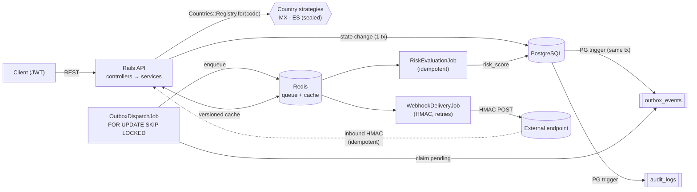

# Bravo Fintech MVP

Multi-country credit-application API for a fintech operating across LATAM and
Europe. Primary implementations: **México (MX)** and **España (ES)**, designed so
that adding a third country is configuration, not code.

> Architectural signature: *"The first implementation defines the architecture; the
> second is configuration, not code."*

**Status:** backend complete and fully tested — authenticated sync CRUD, two
countries, and the async pipeline (transactional outbox → dispatcher → Sidekiq →
webhooks). Frontend, realtime (ActionCable), and Kubernetes manifests are the
remaining milestone.

## Stack

Rails 7.2 (API-only) · PostgreSQL 15 · Sidekiq + Redis · JWT · Pundit · AASM ·
Docker Compose · RSpec · RuboCop · React + Tailwind (upcoming) · Kubernetes
(upcoming).

## Architecture



**The core decision (req 3.7 + 3.9):** a PostgreSQL trigger writes an
`outbox_events` row in the *same transaction* as the state change — the state can
never change without an event. A dispatcher claims pending events with
`SELECT … FOR UPDATE SKIP LOCKED`, so N dispatchers run in parallel without ever
double-claiming, and enqueues idempotent Sidekiq jobs. One coherent pattern
covers async work, parallelism, and the produce/consume story.

## Setup (< 5 minutes)

**Prerequisites:** Docker + Docker Compose and `make`. No local Ruby — everything
runs in containers.

```bash
git clone <repo-url> && cd fintech-mvp
make up      # build image, boot api + postgres + redis + worker, load schema
make seed    # users per role + sample MX/ES applications
```

`make up` waits until the API is healthy. Verify and log in:

```bash
curl localhost:3000/up                       # => 200

# Log in (seeded users; password for all: password123)
curl -s localhost:3000/api/v1/login \
  -H 'content-type: application/json' \
  -d '{"email":"operator@bravo.test","password":"password123"}'
# => {"token":"<JWT>","role":"operator"}
```

Seeded users: `admin@bravo.test`, `analyst@bravo.test`, `operator@bravo.test`.

Everything else:

```bash
make test     # full RSpec suite
make lint     # RuboCop + bundler-audit
make console  # Rails console
make logs     # tail api logs
make down     # stop everything
make help     # list all commands
```

## API tour

```bash
TOKEN=$(curl -s localhost:3000/api/v1/login -H 'content-type: application/json' \
  -d '{"email":"analyst@bravo.test","password":"password123"}' | jq -r .token)
AUTH="authorization: Bearer $TOKEN"

# Supported countries (cached catalog)
curl -s localhost:3000/api/v1/countries -H "$AUTH"

# Create an application (MX). document_type is derived from the country.
curl -s localhost:3000/api/v1/credit_applications -H "$AUTH" -H 'content-type: application/json' \
  -d '{"credit_application":{"country":"MX","full_name":"Ana","document_number":"HEGG560427MVZRRL04","amount_requested":100000,"monthly_income":25000}}'

# List with filters + pagination
curl -s "localhost:3000/api/v1/credit_applications?country=MX&status=received&per_page=10" -H "$AUTH"

# Show one (scope-aware, cached)
curl -s localhost:3000/api/v1/credit_applications/<id> -H "$AUTH"

# Change status (analyst/admin). Optimistic locking via lock_version.
curl -s -X PATCH localhost:3000/api/v1/credit_applications/<id>/status -H "$AUTH" \
  -H 'content-type: application/json' \
  -d '{"credit_application":{"event":"approve","lock_version":0}}'
```

Valid sample documents: MX CURP `HEGG560427MVZRRL04`, ES DNI `12345678Z`.

## Assumptions

- **Bank providers are simulated.** Each country's `BankProvider` returns a
  provider-specific shape derived deterministically from the document number
  (stable across fetches and tests). A per-country `Normalizer` maps it to one
  internal `BankData` (`total_debt` / `credit_score` / `account_status`); the raw
  payload is retained in `jsonb` for audit.
- **Encryption / blind-index / JWT / webhook keys** are read from the
  environment. The development defaults in `config/application.rb` and
  `.env.example` are **non-secret placeholders** — production supplies real keys
  via the secrets manager.
- **Business rules:** MX — `amount_requested ≤ monthly_income × 30`; ES —
  `amount_requested ≤ €50,000`. A breach routes the application to `under_review`
  with a `requires_review` flag.
- **The external webhook endpoint is simulated** (`WEBHOOK_ENDPOINT_URL`,
  default `example.com`); failed deliveries are recorded and retried by Sidekiq.
- **Deliberately out of scope for now** (see `EXECUTION_PLAN.md → Backlog`): rate
  limiting, circuit breakers, dead-letter queues, Prometheus metrics, tracing.

## Data model

UUID primary keys throughout (multi-country fintech: avoids collisions and does
not leak volume through sequential IDs).

```
users                       credit_applications              bank_records
─────                       ───────────────────              ────────────
id (uuid, pk)               id (uuid, pk)            1     1  id (uuid, pk)
email (citext, uniq)        country                ───────  credit_application_id (fk)
password_digest             full_name      (enc)             provider
role (enum)                 document_number(enc, det)        total_debt   ┐ normalized
                            document_fingerprint (uniq)      credit_score │ from the raw
                            monthly_income (enc)             account_status┘ provider shape
                            amount_requested                 raw_payload (jsonb)
                            status / risk_score / flags      fetched_at
                            lock_version (optimistic)
                               │ 1        │ 1
                    ┌──────────┘          └──────────┐
                    │ N                              │ N
            state_transitions                 webhook_deliveries
            from/to_state, actor_id,          endpoint, status, attempts, last_response

Async / audit (driven by PG triggers):  outbox_events · audit_logs · webhook_events
```

Key decisions:

- **PII at rest** (`full_name`, `document_number`, `monthly_income`) is encrypted
  with Active Record encryption. `document_number` uses **deterministic**
  encryption so it stays searchable for dedupe; the others use stronger
  **non-deterministic** encryption. `amount_requested` is not PII → plaintext.
- **`document_fingerprint`** is a keyed HMAC of the normalized document number,
  uniquely indexed — dedupe/lookup without ever decrypting.
- **`raw_payload` (`jsonb`)** keeps the provider response verbatim, decoupling the
  domain from provider shape changes (only the Normalizer moves).
- **Indexes:** `(country, status, created_at)` for the critical listing query;
  unique `(document_fingerprint)`; partial `(created_at) WHERE processed_at IS NULL`
  on the outbox; FK indexes.

## Technical decisions (with tradeoffs)

- **Transactional outbox over publish-to-queue-directly.** Guarantees atomicity
  of state↔event (a PG trigger writes the event in the same transaction). Cost:
  polling latency from the dispatcher — mitigable with PostgreSQL LISTEN/NOTIFY
  or a tighter loop. Chosen over event sourcing/CQRS, which would be
  over-engineering here.
- **`SELECT … FOR UPDATE SKIP LOCKED` for the dispatcher.** Lets K dispatchers run
  as independent replicas with no coordination; each skips rows another holds.
  Delivery is at-least-once, so consumers are idempotent.
- **Country logic sealed behind a registry.** All country behavior lives in
  `app/countries/<code>/` and resolves via `Countries::Registry`; country codes
  never appear in controllers/services/jobs/models. Adding a country is purely
  additive (see below). The state machine (AASM) lives in a PORO that wraps the
  application, so the shared model carries no country/state logic.
- **SQL schema format + PostgreSQL 15.** Triggers/functions can't be represented
  in Ruby `schema.rb`, so `db/structure.sql` is the source of truth (and the test
  DB has the triggers). PG pinned to 15 to match the `pg_dump` client in the image.
- **Result pattern** (`Success`/`Failure`) instead of exceptions for control flow;
  jobs receive IDs and are idempotent.

## Security

- **PII encrypted at rest**; serializers are **scope-aware** — operators get a
  redacted view, analysts/admins see PII (`CreditApplicationPolicy#view_pii?`).
- **JWT** bearer auth on every endpoint by default (opt-out for login + webhooks).
- **Pundit** role authorization (operator / analyst / admin).
- **No PII in logs** — `StructuredLogger` emits JSON with `event`/`country`/
  `application_id` and strips PII keys defensively.
- **No plaintext PII in the audit trail** — the audit trigger captures the
  ciphertext for encrypted columns.
- **HMAC-SHA256** on webhooks (inbound verified over the raw body; outbound signed).
- Secrets are env-injected; `config/master.key` and `.env` are git-ignored.

## Concurrency

- **Transactional outbox + `SKIP LOCKED`**: N dispatcher replicas, no double
  processing. Scaling = more replicas (`docker compose up --scale worker=N`), no
  code change.
- **Idempotent jobs**: `RiskEvaluationJob` writes `risk_score` via a conditional
  `UPDATE … WHERE risk_score IS NULL`; webhook inbound dedupes by `idempotency_key`.
- **Optimistic locking** (`lock_version`) on status changes → `409` on a stale write.
- **AASM guards** reject invalid transitions (`422`, state unchanged).

## Caching

- **Single-application reads** cached via `Applications::CachedView`, keyed by
  `cache_key_with_version` (id + `updated_at`) **and PII scope**. A write changes
  `updated_at` → the key changes → stale data is never served (no manual busting),
  and an operator's redacted view is never served to an analyst.
- **Country catalog** (`Countries::Catalog`) cached with a 12h TTL (it only
  changes on deploy). Store: `redis_cache_store` (dev/prod), `memory_store` (test).

## Webhooks

- **Outbound** (`WebhookDeliveryJob`, triggered on status change via the outbox):
  HMAC-signed POST to the external endpoint, each attempt recorded in
  `webhook_deliveries`, raises on failure so Sidekiq retries.
- **Inbound** (`POST /api/v1/webhooks/bank`): signature verified over the raw
  body; deduped by `idempotency_key` (unique index + pre-check) so a replay is
  processed exactly once; mutates the application (bank confirmation).

## How to add a country (architectural signature)

Adding a country is *configuration, not code*: create `app/countries/<code>/`
with the four strategy classes (`Validator`, `BankProvider`, `Normalizer`,
`StateMachine`) and add **one line** to `Countries::Registry::NAMESPACES`.
Nothing in controllers, services, jobs, or models changes.

**Evidence — adding España (ES):**

- **Files changed outside `app/countries/es/`: 1** — `app/countries/registry.rb`
  (the registry line). No controller/service/job/model touched.
- ES brought a genuinely different DNI mod-23 validator, a different bank-provider
  shape (`total_liabilities`/`scoring`/`account_state`) collapsed by its own
  normalizer, and a different business rule (a €50,000 review threshold vs MX's
  30× income ratio) — all sealed inside `app/countries/es/`.
- The existing create / list / show / status pipeline, transactional outbox,
  risk job, and webhooks handle ES with zero changes; the full MX test suite
  stayed green.

The measure of the abstraction isn't how fast ES was written — it's that a third
country is purely additive: a new directory plus one registry line, with no risk
of disturbing the countries already in production.

## Testing

TDD throughout (RSpec). `make test` runs the full suite; Bullet raises on N+1 in
test (so an N+1 fails the build), and `make lint` runs RuboCop + bundler-audit.
Coverage spans models/encryption, policies, the country strategies (CURP/DNI
algorithms, normalizers), the create/read/list/status request flows, the outbox
trigger + parallel dispatcher (real-thread `SKIP LOCKED` test), the idempotent
risk job, and both webhook directions.

## What's next

Frontend (React + Tailwind: create / list / detail / status), realtime via
ActionCable, Kubernetes manifests, and the scalability deep-dive (partitioning by
`LIST(country)` + `RANGE(created_at)`, archival of terminal partitions). See
`EXECUTION_PLAN.md`.
